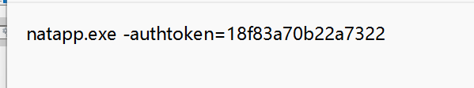
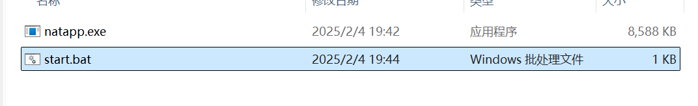
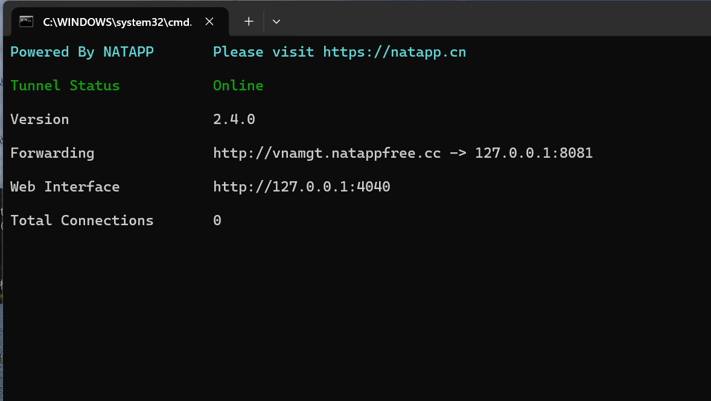
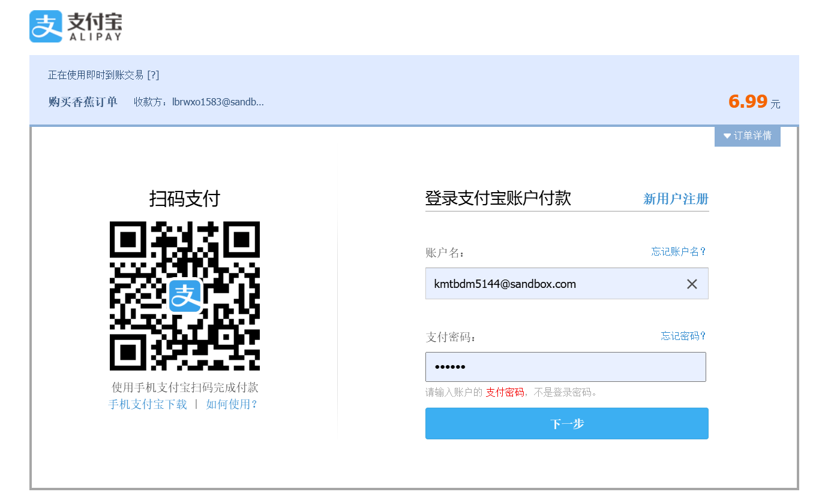

# 支付宝沙箱集成指南

## 1. 沙箱地址
- [沙箱环境](https://open.alipay.com/develop/sandbox/app)

## 2. 官方文档
- [官方文档](https://opendocs.alipay.com/open/270/01didh)

## 3. 支付账号信息

### 3.1 商家信息
- **商户账号**: lbrwxo1583@sandbox.com
- **登录密码**: 111111
- **商户PID**: 2088721056498044
- **账户余额**: 1000006.99

### 3.2 买家信息(支付宝沙箱app登录的账号，也是扫码付款的账号)
- **买家账号**: kmtbdm5144@sandbox.com
- **登录密码**: 111111
- **支付密码**: 111111
- **用户UID**: 2088722056498056
- **用户名称**: kmtbdm5144
- **证件类型**: IDENTITY_CARD
- **证件号码**: 51610519890413583X
- **账户余额**: 999993.01

## 4. natapp 地址
- **官网**: [natapp官网](https://natapp.cn/)
- **下载**: [百度网盘](https://pan.baidu.com/s/1L99Ibawylnck4b4c0NtmXg?pwd=685x) (提取码: 685x)



## 5. 配置说明

### 5.1 application.yml 配置


## 在 application.yml 里面进行配置
```yaml
alipay:
    appId: 9021000143681075
    appPrivateKey: MIIEvQIBADANBgkqhkiG9w0BAQEFAASCBKcwggSjAgEAAoIBAQCk1UKxWk0MabfW/UjC0FM9s7D62u5R/0pGY5SjGWjFboNFPGQ8lQyJxRjHSLeDQM8pCdwLevXgZJXGtFMkPeo54TVS8LBYJ9fP9stvLdqCZOBvAxisG6mUAoJ8s8BxEGy1PhiikoSkNq7JcyO9SytRg0YdbIOCQa0iZ7GTtpnoitjZBE9oyZDgaXEGk0K46CJPIN5+yG6Q0X7+X8nB8CDB7v0PJp4uizlvn8nA4QcfoM8bmBtYlhE9bB9CUTm2xPzayeUE8LpIYQ3cxiD0q/B/7vuKsyLFsfWG8aLXi/kpZZVMgbswEwNVy058VHVbjxk8OsMZWMsGjEpg+26GknbhAgMBAAECggEAM2lU8O5CY+HBdmvvutuxauhWBhgtByRCLWw32xs8w3+xr/GjLgYrL/lqvhWfL3ASbTFnEambcQ7ObHioCgDJwp3MvP7XcdeTh4jpcNbzdYIzQkzL8Dp8jO6vdme2WU2PKoSguGxMtM9devXPquX8L+NrBhhneEQ11SpUh8cHgDD2Ax2Ta9ZlYULT9OrD8A7ChNGJ8iq8qNhbvnEUc4Bn4s6xoHkUsIKE8CTETaOqGfLNQJWrAgbtWXDsmc1TV9iQvwbI0es5HqR9ut6d+4ifhmfk3EGfSIPWrTOcB5xDVcW3FXspstghvNdmvxcwwe2vc8VEgBFOzTU17aAnggg3JQKBgQDbF+XkvJOKElFJ7mymYi2YBXSY1PKU5c6VKxeUBymNK9N+M48G3EALph2vl6fC9+J7PETvM7BviPsm2yOpXM4hIQU51hcnf4T9oG7WT8FTgh35QFndJwl1UzbyWY17O/ea2fE5IoDLlXD60iatFKBKgO+4CMUKUriC0oN3TdwAfwKBgQDAmXYAc+f2dAUtJYRqiJ1tc102RnmgdtyiFCUxzWaDg/2bsrfM51Mp2Kpvl/j1orQuSJBU3OxaLTFcdaGlRtEELswFqLTXJ2toH6HJCHLL/jysUyjSrJVMoNvGR+mXHMtOzkLSAVMww26VQi58TlD9YJLqCQCsnsl7s50Cc/3YnwKBgQCV9z6yGe43dSBVJbETFmK1Cw7rSd+d0ctcyXlDJr/nVJdYa/w7qujf0F3DgmAfkUNiLTfWL6BWSAH5b8hyNgcWIB8Onp+MtrmWTYlwgnkHKypPISAhw4Wy3DnhGzE/qCVsxj9aZ2aXc3w5Az3b/SFWvfjYFJCi50pKqcO5Fv8/CwKBgACbu3qu4wmtPiLxXmSzv8OLvLyiJloyZeoBJEju/CboMNHgE6KLDIEyVP97PGcSN3157zLFa92xDNnc6UDLY3ee6jgOW1venQE8MFehNjOcvvZQYO2ha+tNCsSqj3tRtPavwhhFtsyNoXjJN7peyPSz7GLe2mixK7O/UnyifyfDAoGAIdq7QaEdJ9P2f2ld6XquyFLTIU7FsWIVQuIg+2lYfhVgZKmk7TSmQIhQfmTtsJuwF6rcUJ0lGQ9YRzyb50Zt1pFGLh1GgpdjNRnndmBhTMcYvrJzIF3GUTDlr2f48aywvVVk14pQf1XybfU4hMXrW1Fym0wYP2UgxaRILow6W1s=
    alipayPublicKey: MIIBIjANBgkqhkiG9w0BAQEFAAOCAQ8AMIIBCgKCAQEAgdWRcUvzFWyW75KGuuSUXcozCEHFVfBK7ag8Lz/NhAAjJlMciL5wGTmVC7wzVOAC6W+BTMvRYUOmOmZYDnhtN2ZJO2HcL1ESvUP4b/YP6qmG5fpUp+6ukoRDu44Toxe9IqUVylzXh3j17inspf2QXoX8LexchTFY98m/X+odfHh2mKZ/8/xkYwY1M7yTud8plQCopmuzv3ybCrOJ5M+TyqwW40wcPT1Gj1OaGMQzpJPiolxdOtfIBSryiUQ4nvWfcmcLMk0PvNhIX/lxZVfFCGmM8ohobJstl7sFnjmtje+tUN++bzUcVBdjCaysNgG1l+Hk3NFqcaL/zGJr1Yb7uQIDAQAB
    notifyUrl: http://jgq2ve.natappfree.cc:8081/alipay/notify
    returnUrl: http://localhost:8081/orders
#  应用私钥:MIIEvQIBADANBgkqhkiG9w0BAQEFAASCBKcwggSjAgEAAoIBAQCuudibII1/RFe843p2R2qdXZ2xZDpyfHW0O2HaVSp9HjyuXFXKnmd7CmTAkS8HRPWbcEClPWdQwE5UVs3P7/pcisDEjytJhB4xHKsPFvth5zFvIvWa9HlJXUDTuxziXKA6Ra4OVYkQsgZJkEraJl+Yzzd9b1cANDpFdsBeg7GUNBmxDwISHzCXXdU7sFqZKKyZRcf7lfe99HtGWzZAf3kHMC7vmdRXOT93TMUxe1myGpeoVWub0FusZxdySTNeUgMTNJADb4bJwbFdDQtqMlQeyX6LAzDAVw4k6B6k6SDR4snzeaauJDtOqSQYLxgJ9OoTQYzipOm3Fo1rlFULdswLAgMBAAECggEAd7QlPKoBprZIscTa6lulJCi114lGLZctAIxKTs1YLZ3gjsf9krIRTQ9i1TbiFEXfSl2OPGaj+IO3ZjqOCC5txKbeyAsZ6eTU1mrAmrbxBDLjADPgNgfVbDiyKByh/kbdEu8X/wQEwmZkvlNXpLrzdXpJlusHnMErRtnDkz0AFPq2Gi0TGhr9jErZ5HI/E7EalrJ5j8PbTDOLJhi+3BULzsTAmaQNBqfd0sQmGj+yboI9BUVH09TIbZM7YbjV6goxwFGdcIWkcDc7r7M6ULSYyawVdI24GqWXEjbvSSbbAUSsT2KOuwndYkSdmdl22+WSoZxh6GEA3X2BbszeaGjWUQKBgQDkMz7TK29F8U0lbpRHPhG+Z0zfDa47kIu45fJzHK+rrl51Umq6iUJkoCdDTmJgcda9puMwQyC/qvUx+JGLhAwr/9ulsh6BWygDR8EchfsaGhHRYLSEjqn97SATG77k+dfxIPGtKZiCGsAhSNrS8kaD0lo+lVGkfQ+k4/D+3xh4YwKBgQDEAu3xxba7ahBmjMnEz0trJ4ycTwZ9Vrl7VHb8/AahU0YlSzZ8g4j7CjjtlX+uD8125ticWTxNf0EqEScnetlJdESomWcGNVE9mz25d5CdZyndBYZVnhhnp4Rv9BIe1UGOmmvu4XZ4igi/T4f91iNNxPoxTfy3qZKZnePWrplqOQKBgHmjCyjabRyWC64ZLDZxUlnwjBwVGbssSB3NjBdpwgW8EyNsQ/GcOmSSrXsF7BBGfdVngI/4KBuiT8JMIaCBSU+muPiwYexHn6Nn+vpuPDNkk/zMFEzYEqqEW+Vzk6RPvJgOHGRV2LH4+lKDmAh7FbUsSeg0BWmtM8qLqajhWBTLAoGAMQUiiOKPbpN6AouXMlc9X1EGw1ioINR9krBvCZnl9pai5lTHDaC/szi9P/2xbtCY6/GTnpZalG8M1v5vMlpw2QPw39FtiInxBV07tJSIYDUarSHilKrzI4krf+wkU/21ZXqNH7LXNBIhWecD9aGGNr7aa1Y7q5sHBNAN2PTVfVECgYEAkOdUJsl8du8O2wdjrrjhhXQ7Qz8wnDSFgxdLV6PFcC+3cho3hf5sIMfvh3Bmhd3eEit3hsr1T5ja9fb+ICHlftFrzxQMV0kOKz9yWrk5TX4xCVB9RlUO9qtjsa1xxbF57DaskDIi3M7ciD34nseHz9UJAjZduW3Zwg+bo5H7gCc=
#  应用公钥：MIIBIjANBgkqhkiG9w0BAQEFAAOCAQ8AMIIBCgKCAQEArrnYmyCNf0RXvON6dkdqnV2dsWQ6cnx1tDth2lUqfR48rlxVyp5newpkwJEvB0T1m3BApT1nUMBOVFbNz+/6XIrAxI8rSYQeMRyrDxb7YecxbyL1mvR5SV1A07sc4lygOkWuDlWJELIGSZBK2iZfmM83fW9XADQ6RXbAXoOxlDQZsQ8CEh8wl13VO7BamSismUXH+5X3vfR7Rls2QH95BzAu75nUVzk/d0zFMXtZshqXqFVrm9BbrGcXckkzXlIDEzSQA2+GycGxXQ0LajJUHsl+iwMwwFcOJOgepOkg0eLJ83mmriQ7TqkkGC8YCfTqE0GM4qTptxaNa5RVC3bMCwIDAQAB
#  支付宝公钥：MIIBIjANBgkqhkiG9w0BAQEFAAOCAQ8AMIIBCgKCAQEAgdWRcUvzFWyW75KGuuSUXcozCEHFVfBK7ag8Lz/NhAAjJlMciL5wGTmVC7wzVOAC6W+BTMvRYUOmOmZYDnhtN2ZJO2HcL1ESvUP4b/YP6qmG5fpUp+6ukoRDu44Toxe9IqUVylzXh3j17inspf2QXoX8LexchTFY98m/X+odfHh2mKZ/8/xkYwY1M7yTud8plQCopmuzv3ybCrOJ5M+TyqwW40wcPT1Gj1OaGMQzpJPiolxdOtfIBSryiUQ4nvWfcmcLMk0PvNhIX/lxZVfFCGmM8ohobJstl7sFnjmtje+tUN++bzUcVBdjCaysNgG1l+Hk3NFqcaL/zGJr1Yb7uQIDAQAB
```


## 实现回调功能

- 加配置(前端支付页面的地址)：alipay.returnUrl=http://localhost:8081/orders
- AlipayConfig.java 加一个属性：returnUrl
- AliPayController.java的pay接口设置回调的url：request.setReturnUrl(aliPayConfig.getReturnUrl());

## 页面调用

window.open('http://localhost:8081/alipay/pay?traceNo=' + row.orderNo + "&totalAmount=" + row.price + '&subject=' + row.name)

## 注意
- 需要下载natapp 内网穿透 
- 

